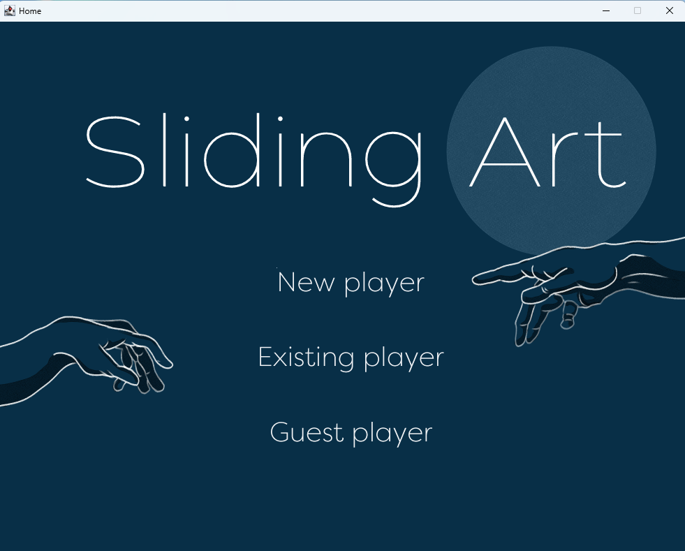
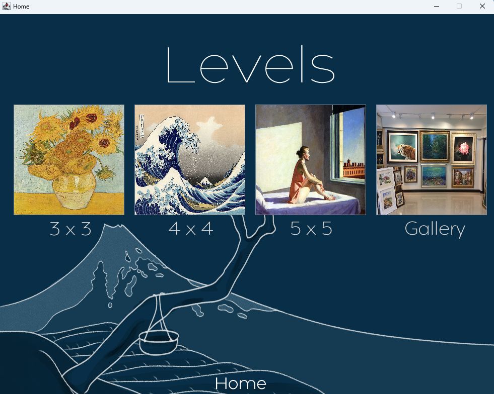
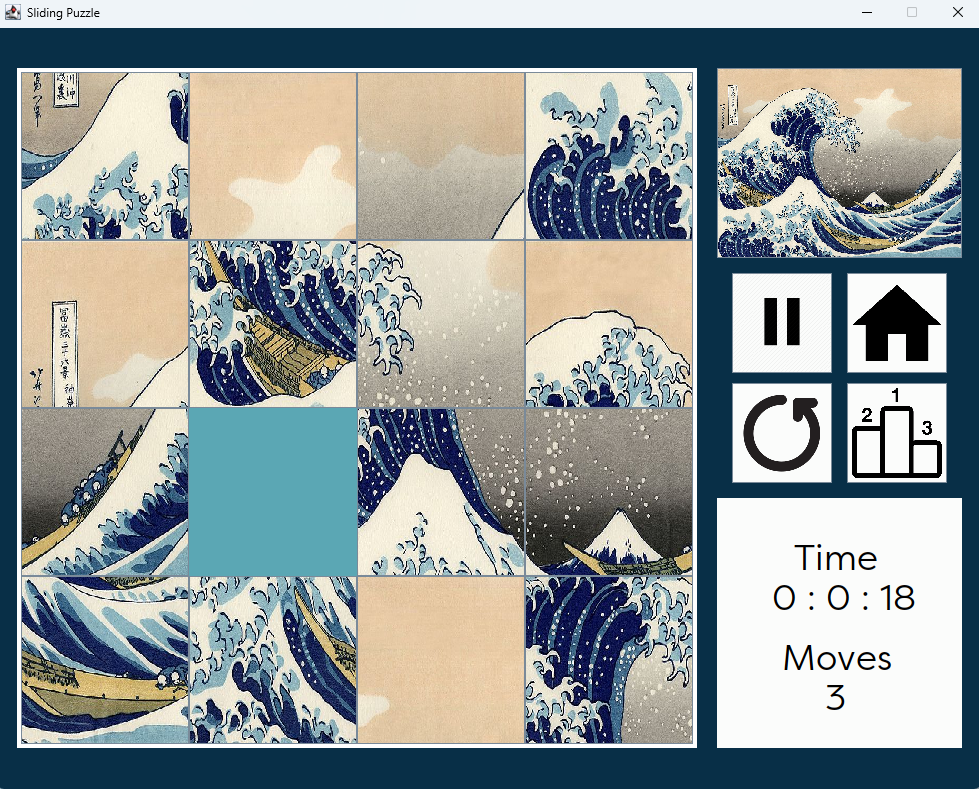

# Sliding Puzzle

This project contains all the documents needed to run the "Sliding Puzzle" game. This game consists of sliding the pieces of images one after the other on a platform with an empty square until all are put in order and the final image appears.

## Application Screenshots

Below are some screenshots of the game interface:

- Home Screen: Displays the game title and main menu options.

- Level Selection Page: Allows players to choose difficulty levels.

- Game Interface: Shows the puzzle grid where players can slide pieces to solve the puzzle.

## Sliding_Puzzle Folder Contents

The `Sliding_Puzzle` folder contains 7 folders and 2 files:

### Folders

- **BACKUP**: Contains 3 backup files (.dat files) corresponding to the 3 lists of players with the name and the time of each player according to the level.
- **bin**: Holds binary files (.class files), which are the actual executable code for the game.
- **Font**: Contains a TTF file, which is a font used in the game.
- **Images**: Holds image files (.jpg and .png files) used in the game as scenery and buttons.
- **Masterpiece**: Contains image files (.jpg and .jpeg files) of masterpieces by various artists. These are used in the gallery of the game to allow the player to choose a masterpiece.
- **Song**: Holds an audio file (.wav file) corresponding to the background music.
- **src**: Contains the source code in .java file format. The main class is in `Launcher.java`.

### Files

- **.classpath**: Maintains the project's source and target references for Java compilation and compressed file or project dependencies.
- **.project**: Holds the project nature and builders.

## How to Run the Game

To code this game, we used "Visual Studio Code" and "Eclipse". To launch the game, we advise you to use one of these two software options:

### With Eclipse

1. In a new workspace, select "Import existing projects".
2. Choose the `Sliding_Puzzle` folder in "Select root directory".
3. Click the "Finish" button.
4. Run the main class located in `Launcher.java` (in the `src` folder).

### With Visual Studio Code

1. Open the `Sliding_Puzzle` folder.
2. Run the main class located in `Launcher.java` (in the `src` folder).
